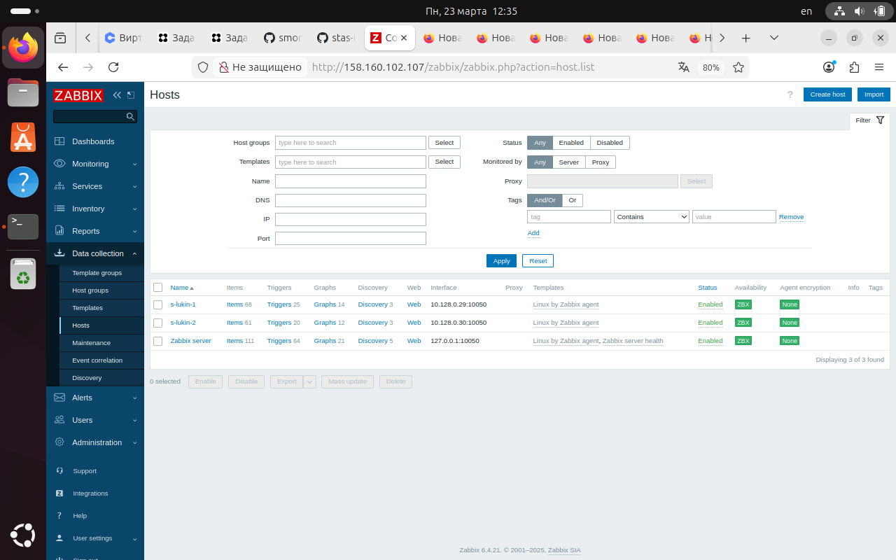

# Домашнее задание: Система мониторинга Zabbix

**Студент:** Лукин Станислав
**Дата:** 23 марта 2026

---

## Задание 1. Создание шаблона с элементами CPU и RAM

### Шаблон CPU and RAM Monitor

*Рисунок 1. Шаблон CPU and RAM Monitor с элементами CPU Custom Load и RAM Custom Usage*

---

## Задание 2-3. Добавление хостов и привязка шаблонов

### Хост s-lukin-1

*Рисунок 2. Хост s-lukin-1 с привязанными шаблонами Linux by Zabbix agent и CPU and RAM Monitor*

### Хост s-lukin-2

*Рисунок 3. Хост s-lukin-2 с привязанными шаблонами Linux by Zabbix agent и CPU and RAM Monitor*

---

### Список хостов

*Рисунок 4. Хосты s-lukin-1 и s-lukin-2 в разделе Hosts*

---

### Сбор данных с хостов

*Рисунок 5. Данные с хостов s-lukin-1 и s-lukin-2: CPU Custom Load и RAM Custom Usage*

---

## Задание 4. Создание кастомного дашборда

*Рисунок 6. Дашборд "Мониторинг CPU и RAM" с графиками для двух хостов*

---

## Заключение

В результате выполнения домашнего задания:

1. Создан шаблон `CPU and RAM Monitor` с элементами для сбора загрузки CPU и RAM
2. Добавлены хосты `s-lukin-1` и `s-lukin-2` с привязкой шаблонов
3. Настроены UserParameter на агентах для кастомных ключей:
   - `custom.cpu.load` — загрузка CPU из /proc/stat
   - `custom.ram.usage` — использование RAM из free
4. Создан дашборд `Мониторинг CPU и RAM` с четырьмя графиками
5. Все скриншоты подтверждают работоспособность системы
