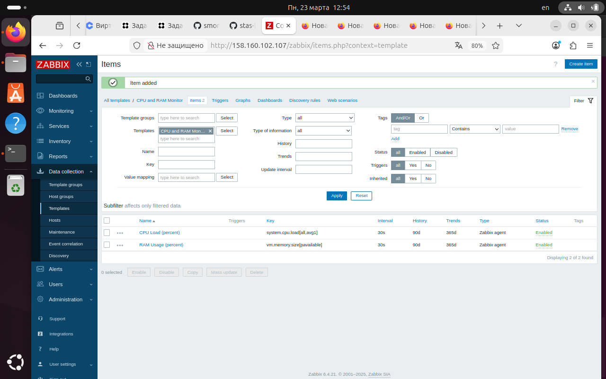
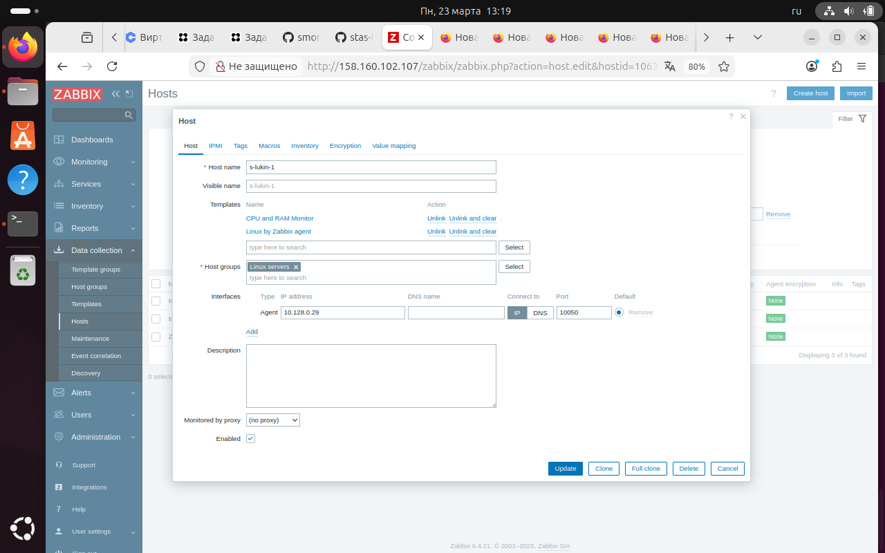
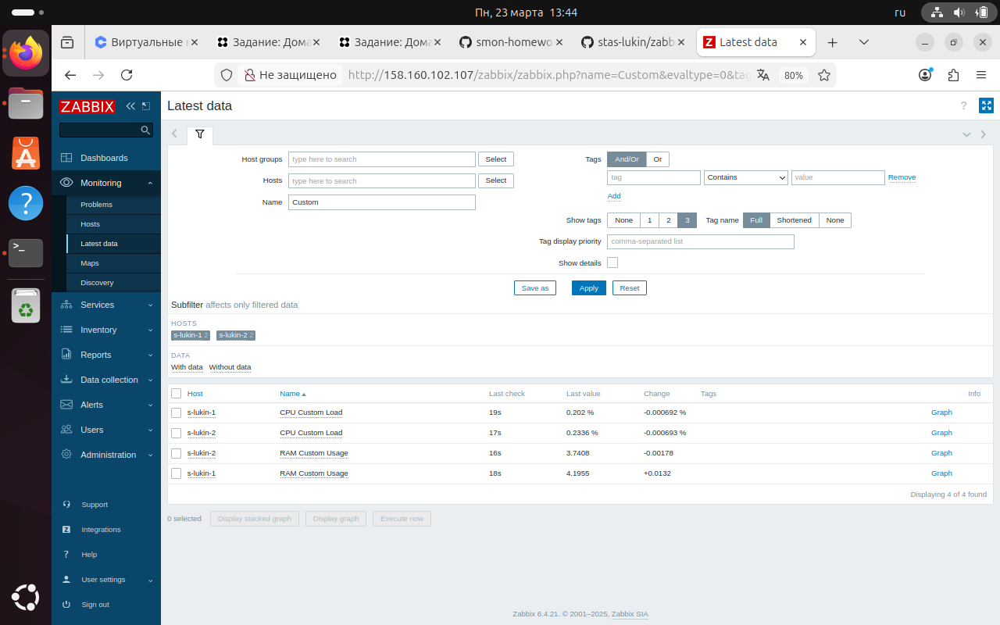
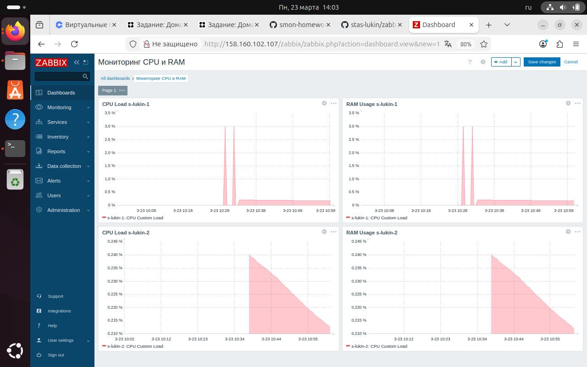

# Домашнее задание: Система мониторинга Zabbix

**Студент:** Лукин Станислав  
**Дата:** 23 марта 2026

---

## Задание 1. Установка Zabbix Server с веб-интерфейсом

### Использованные команды
Обновление списка пакетов

sudo apt update
Установка PostgreSQL

sudo apt install -y postgresql postgresql-contrib
Добавление репозитория Zabbix

cd /tmp
wget https://repo.zabbix.com/zabbix/6.4/debian/pool/main/z/zabbix-release/zabbix-release_6.4-1+debian11_all.deb
sudo dpkg -i zabbix-release_6.4-1+debian11_all.deb
sudo apt update
Установка Zabbix Server

sudo apt install -y zabbix-server-pgsql zabbix-frontend-php php-pgsql zabbix-apache-conf zabbix-sql-scripts zabbix-agent
Создание базы данных

sudo -u postgres createuser --pwprompt zabbix
sudo -u postgres createdb -O zabbix zabbix
Импорт структуры базы данных

sudo -u zabbix psql zabbix < /usr/share/zabbix-sql-scripts/postgresql/server.sql
Настройка пароля в конфиге

sudo nano /etc/zabbix/zabbix_server.conf # добавить DBPassword=zabbix123
Запуск сервисов

sudo systemctl restart zabbix-server zabbix-agent apache2
sudo systemctl enable zabbix-server zabbix-agent apache2

### Результат

  
*Рисунок 1. Главная панель администратора*

---

## Задание 2. Установка Zabbix Agent на два хоста

### Agent 1 (s-lukin-1)

#### Команды для установки и настройки
Подключение к агенту

ssh -i ~/.ssh/zabbix_key monitor-user@158.160.118.50
Установка агента

sudo apt update
sudo apt install -y zabbix-agent
Настройка конфигурации

sudo nano /etc/zabbix/zabbix_agentd.conf
Изменены параметры:
Server=10.128.0.17
ServerActive=10.128.0.17
Hostname=s-lukin-1
Запуск агента

sudo systemctl restart zabbix-agent
sudo systemctl enable zabbix-agent

#### Лог агента

  
*Рисунок 2. Лог работы агента s-lukin-1*

### Agent 2 (s-lukin-2)

#### Команды для установки и настройки
Подключение к агенту

ssh -i ~/.ssh/zabbix_key monitor-user@46.21.244.242
Установка агента

sudo apt update
sudo apt install -y zabbix-agent
Настройка конфигурации

sudo nano /etc/zabbix/zabbix_agentd.conf
Изменены параметры:
Server=10.128.0.17
ServerActive=10.128.0.17
Hostname=s-lukin-2
Запуск агента

sudo systemctl restart zabbix-agent
sudo systemctl enable zabbix-agent

#### Лог агента

  
*Рисунок 3. Лог работы агента s-lukin-2*

---

### Добавление хостов в веб-интерфейс

В веб-интерфейсе Zabbix:
1. **Data collection → Hosts → Create host**
2. Для **s-lukin-1**:
   - Host name: `s-lukin-1`
   - Groups: `Linux Servers`
   - Interfaces: Agent → IP: `10.128.0.29`, Port: `10050`
   - Templates: `Template OS Linux by Zabbix agent`
3. Для **s-lukin-2**:
   - Host name: `s-lukin-2`
   - Interfaces: Agent → IP: `10.128.0.30`, Port: `10050`
   - Templates: `Template OS Linux by Zabbix agent`

### Результат

  
*Рисунок 4. Все три хоста с зелёными индикаторами ZBX*

---

## Задание 3. Создание шаблона и привязка к хостам

### Шаблон CPU and RAM Monitor

  
*Рисунок 5. Шаблон CPU and RAM Monitor с элементами CPU Custom Load и RAM Custom Usage*

### Хосты с привязанными шаблонами

  
*Рисунок 6. Хост s-lukin-1 с шаблонами Linux by Zabbix agent и CPU and RAM Monitor*

  
*Рисунок 7. Хост s-lukin-2 с шаблонами Linux by Zabbix agent и CPU and RAM Monitor*

### Сбор данных

  
*Рисунок 8. Данные с хостов s-lukin-1 и s-lukin-2: CPU Custom Load и RAM Custom Usage*

---

## Задание 4. Создание кастомного дашборда

  
*Рисунок 9. Дашборд "Мониторинг CPU и RAM" с графиками для двух хостов*

---

## Заключение

В результате выполнения домашнего задания:

1. Установлен и настроен Zabbix Server 6.4 на Debian 11
2. Установлены и настроены Zabbix Agent на двух хостах
3. Создан шаблон `CPU and RAM Monitor` с элементами для сбора загрузки CPU и RAM
4. Добавлены хосты `s-lukin-1` и `s-lukin-2` с привязкой шаблонов
5. Настроены UserParameter на агентах для кастомных ключей
6. Создан дашборд `Мониторинг CPU и RAM` с графиками для двух хостов

