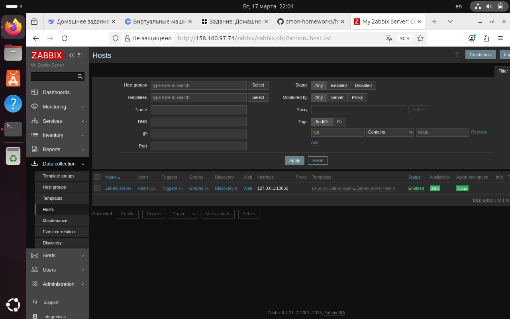
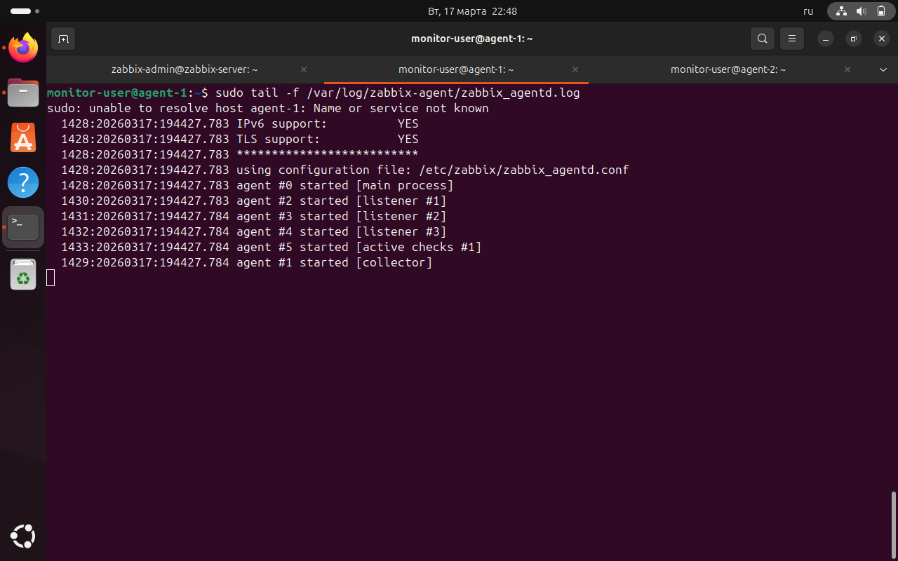
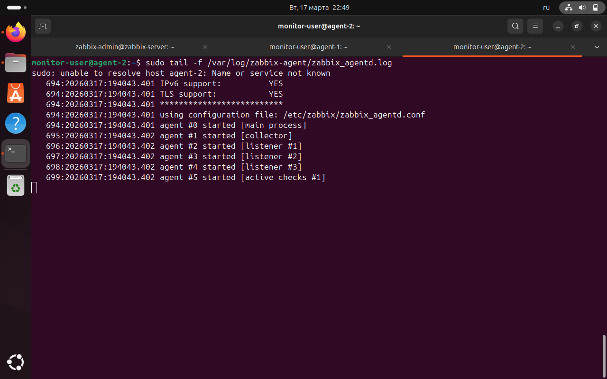
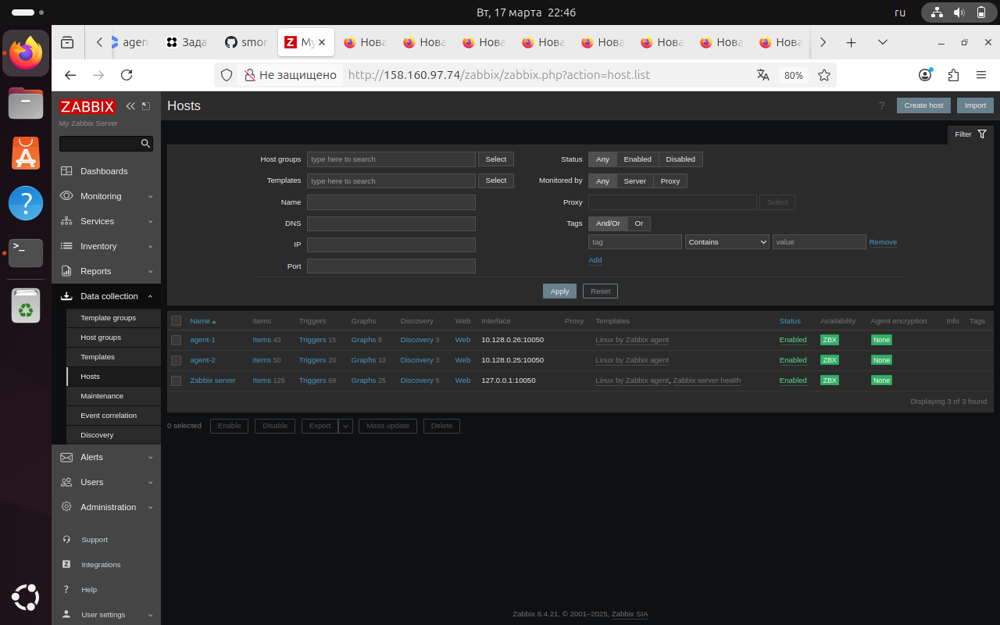
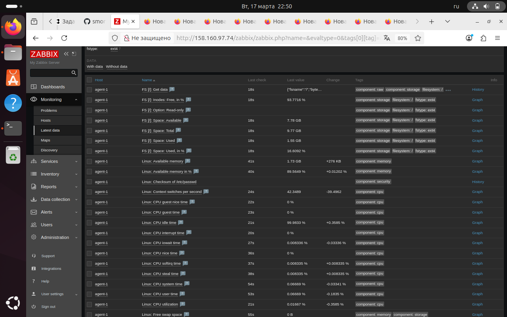
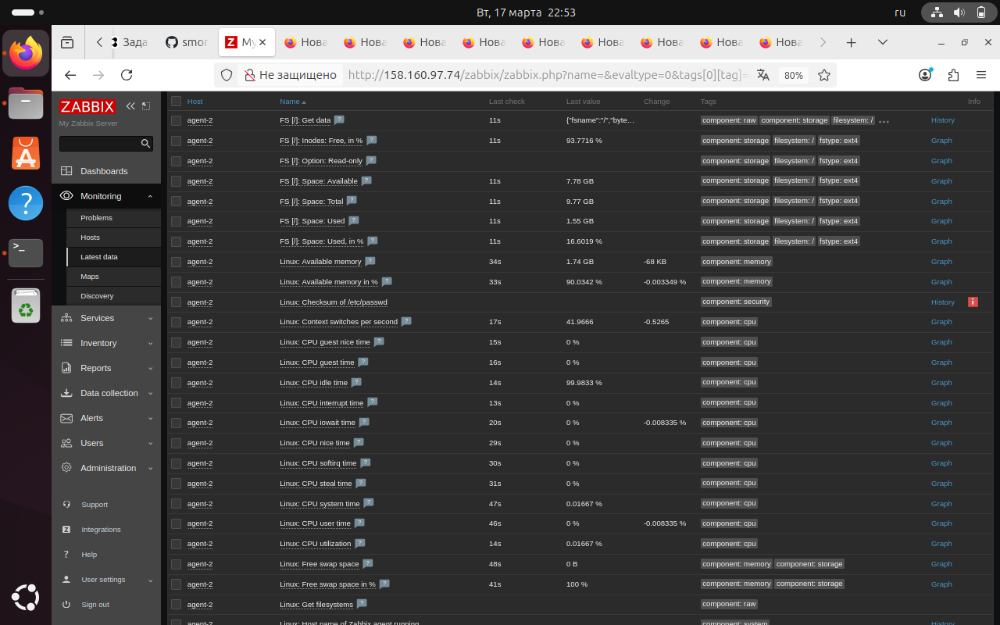

# Домашнее задание: Установка Zabbix

**Студент:** Лукин Станислав
**Дата:** 17 марта 2026

## Задание 1. Установка Zabbix Server с веб-интерфейсом

### Использованные команды

```bash
# Обновление списка пакетов
sudo apt update

# Установка PostgreSQL
sudo apt install -y postgresql postgresql-contrib

# Добавление репозитория Zabbix
cd /tmp
wget https://repo.zabbix.com/zabbix/6.4/debian/pool/main/z/zabbix-release/zabbix-release_6.4-1+debian11_all.deb
sudo dpkg -i zabbix-release_6.4-1+debian11_all.deb
sudo apt update

# Установка Zabbix Server
sudo apt install -y zabbix-server-pgsql zabbix-frontend-php php-pgsql zabbix-apache-conf zabbix-sql-scripts zabbix-agent

# Создание базы данных
sudo -u postgres createuser --pwprompt zabbix
sudo -u postgres createdb -O zabbix zabbix

# Импорт структуры базы данных
sudo -u zabbix psql zabbix < /usr/share/zabbix-sql-scripts/postgresql/server.sql

# Настройка пароля в конфиге
sudo nano /etc/zabbix/zabbix_server.conf  # добавить DBPassword=zabbix123

# Запуск сервисов
sudo systemctl restart zabbix-server zabbix-agent apache2
sudo systemctl enable zabbix-server zabbix-agent apache2
### Результат


*Рисунок 1. Главная панель администратора*

---

## Задание 2. Установка Zabbix Agent на два хоста

### Agent 1 (93.77.176.31)

#### Команды для установки и настройки

```bash
# Подключение к агенту
ssh -i ~/.ssh/zabbix_key monitor-user@93.77.176.31

# Установка агента
sudo apt update
sudo apt install -y zabbix-agent

# Настройка конфигурации
sudo nano /etc/zabbix/zabbix_agentd.conf
# Изменены параметры:
# Server=10.128.0.10
# ServerActive=10.128.0.10
# Hostname=agent-1

# Запуск агента
sudo systemctl restart zabbix-agent
sudo systemctl enable zabbix-agent

#### Лог агента


*Рисунок 2. Лог работы Agent 1*

### Agent 2 (93.77.185.55)

#### Команды для установки и настройки

```bash
# Подключение к агенту
ssh -i ~/.ssh/zabbix_key monitor-user@93.77.185.55

# Установка агента
sudo apt update
sudo apt install -y zabbix-agent

# Настройка конфигурации
sudo nano /etc/zabbix/zabbix_agentd.conf
# Изменены параметры:
# Server=10.128.0.10
# ServerActive=10.128.0.10
# Hostname=agent-2

# Запуск агента
sudo systemctl restart zabbix-agent
sudo systemctl enable zabbix-agent

#### Лог агента


*Рисунок 3. Лог работы Agent 2*

---

## Добавление хостов в веб-интерфейс

В веб-интерфейсе Zabbix:
1. **Data collection → Hosts → Create host**
2. Для **agent-1**:
   - Host name: `agent-1`
   - Groups: `Linux Servers`
   - Interfaces: Agent → IP: `10.128.0.26`, Port: `10050`
   - Templates: `Template OS Linux by Zabbix agent`
3. Для **agent-2**:
   - Host name: `agent-2`
   - Interfaces: Agent → IP: `10.128.0.25`, Port: `10050`
   - Templates: `Template OS Linux by Zabbix agent`

### Результат


*Рисунок 4. Все три хоста с зелёными индикаторами ZBX*

---

## Проверка сбора данных

### Данные с Agent 1


*Рисунок 5. Данные мониторинга с Agent 1*

### Данные с Agent 2


*Рисунок 6. Данные мониторинга с Agent 2*

---

## Заключение

В результате выполнения домашнего задания:
1. Установлен и настроен Zabbix Server 6.4 на Debian 11
2. Установлены и настроены Zabbix Agent на двух хостах
3. Хосты добавлены в систему мониторинга и успешно передают данные
4. Веб-интерфейс доступен и работает корректно
